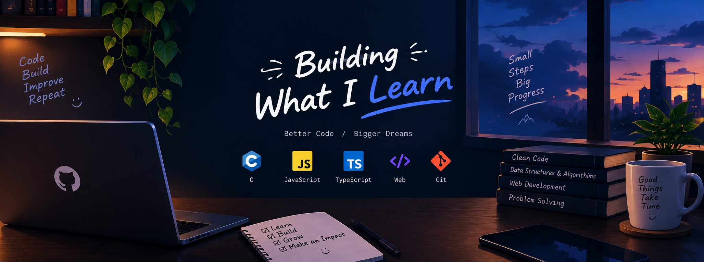

# Hi, I'm Akayed Hossain 👋

### Frontend Developer • Passionate Learner • Future Full-Stack Developer

---

## 👨‍💻 About Me

I'm studying **Computer Science and Engineering at East West University**. Alongside my studies, I'm learning web development through **Programming Hero** and building projects to strengthen my practical skills.

I'm a **passionate learner** who enjoys exploring new technologies and turning ideas into clean, responsive, and modern web experiences.

- 🎓 CSE student at East West University
- 💻 Currently focused on **Web Development**
- ⚛️ Currently learning **Authentication**
- 🧠 Interested in **LLMs and AI**
- 🚀 Goal: Become a **Full-Stack Developer**
- 🌱 Always learning, building, and improving

---

## 🛠️ Tech Stack

### Languages

  

### Frontend

  

### Tools

  

### Design

  
  

---

## 🚀 Featured Project

### Dev. Conf

A web project centered around a **developer conference**, created as part of my web-development learning journey.

**Focus:** Responsive UI • Modern Web Design • Frontend Development

> More projects coming soon as I continue learning and building.

---

## 📊 GitHub Stats & Streak

  
  

  

---

## 📈 Contribution Graph

---

## 💭 Developer Quote

> **"The beautiful thing about learning is that nobody can take it away from you."**

---

## 🤝 Let's Connect

I'm always interested in learning, building, and connecting with other developers.

- 📧 **Email:** [akayedhossain21@gmail.com](mailto:akayedhossain21@gmail.com)
- 💻 **GitHub:** [@akayed-h](https://github.com/akayed-h)
- 🌐 **Facebook:** [Connect with me](https://www.facebook.com/share/1DYTxfWNPP/)

### ⭐ Thanks for visiting my profile!

